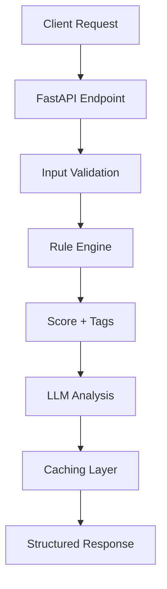

# 🧠 Productivity Insight Engine

A hybrid AI system that analyzes daily productivity using **deterministic rules** and **LLM-generated insights**. The system processes structured daily reports to provide **scores**, **tags**, **explanations**, and **actionable recommendations**.

[](https://www.python.org/)
[](https://fastapi.tiangolo.com/)
[](https://python.langchain.com/)
[](LICENSE)

## � Features

- **Hybrid Analysis**: Combines rule-based scoring with LLM insights
- **Structured Output**: Consistent JSON responses with scores, tags, and explanations
- **Caching Layer**: Redis-based caching for improved performance
- **Rate Limiting**: Protect your LLM API from abuse
- **Container Ready**: Easy deployment with Docker

## 🏗️ Architecture



## 🛠️ Tech Stack

| Component           | Technology           |
|---------------------|----------------------|
| Backend Framework   | FastAPI (Python)     |
| LLM Framework       | LangChain            |
| AI Provider         | Groq (llama-3.3-70b) |
| Caching             | Redis                |
| Validation          | Pydantic             |
| Containerization    | Docker (optional)    |

## 📦 Installation

1. **Clone the repository**
   ```bash
   git clone https://github.com/yourusername/productivity-insight-engine.git
   cd productivity-insight-engine
   ```

2. **Set up a virtual environment**
   ```bash
   python -m venv venv
   source venv/bin/activate  # On Windows: venv\Scripts\activate
   ```

3. **Install dependencies**
   ```bash
   pip install -r requirements.txt
   ```

4. **Configure environment variables**
   ```bash
   cp .env.example .env
   # Edit .env with your configuration
   ```

## ⚙️ Configuration

Create a `.env` file with the following variables:

```ini
# LLM Configuration
LLM_API_KEY=your_groq_api_key
LLM_MODEL=llama-3.3-70b-versatile

# Redis Configuration
REDIS_HOST=localhost
REDIS_PORT=6379
REDIS_DB=0

# Application Settings
DEBUG=True
CACHE_EXPIRE_SECONDS=3600
RATE_LIMIT="100/minute"
```

## 🚀 Quick Start

1. **Start the Redis server**
   ```bash
   docker run -d -p 6379:6379 redis
   ```

2. **Run the FastAPI server**
   ```bash
   uvicorn app.main:app --reload
   ```

3. **Access the API documentation**
   ```
   http://localhost:8000/docs
   ```

## 📚 API Endpoints

### POST /api/v1/analyze

Analyze productivity metrics and generate insights.

**Request:**
```json
{
  "user_id": "123",
  "date_range": "2025-11-29",
  "tasks": [
    {
      "id": "T1",
      "title": "Write report",
      "planned_minutes": 60,
      "actual_minutes": 45,
      "completed": true
    }
  ],
  "deep_work_minutes": 120,
  "meetings_minutes": 40,
  "interruptions": 12,
  "sleep_hours": 6.5,
  "breaks_minutes": 20,
  "mood": 6,
  "notes": "Busy day but productive."
}
```

**Response:**
```json
{
  "score": 72.5,
  "tags": ["good-focus", "insufficient-sleep"],
  "explanations": [
    {
      "rule_id": "R1",
      "description": "Deep work above threshold",
      "effect_on_score": 15
    }
  ],
  "insight": "Your productivity was strong, but interruptions reduced your efficiency.",
  "recommendations": [
    "Schedule deep work blocks in the morning",
    "Aim for 7-8 hours of sleep for better focus"
  ],
  "key_points": [
    "Completed 3/4 tasks (75% completion rate)",
    "Deep work sessions were highly productive"
  ]
}
```

## 🔧 Rule Engine

The rule engine evaluates various productivity metrics:

- **Deep Work**: +15 points for >90 minutes
- **Interruptions**: -10 points for >15 interruptions
- **Sleep**: -8 points for <7 hours
- **Task Completion**: Scored based on completed/planned tasks ratio

## 🤖 LLM Integration

The system uses Groq's LLM to provide natural language insights and recommendations based on the rule-based analysis. The LLM receives structured data and returns:

- **Insight**: A summary of the productivity analysis
- **Recommendations**: Actionable suggestions
- **Key Points**: Important observations

## 🧪 Testing

Run the test suite:

```bash
pytest tests/
```

## 📦 Deployment

### Docker

```bash
docker-compose up --build
```

### Production

For production deployment, consider using:

- Gunicorn with Uvicorn workers
- Nginx as a reverse proxy
- Process manager (PM2, Supervisor, or systemd)

## 🤝 Contributing

1. Fork the repository
2. Create a feature branch (`git checkout -b feature/amazing-feature`)
3. Commit your changes (`git commit -m 'Add some amazing feature'`)
4. Push to the branch (`git push origin feature/amazing-feature`)
5. Open a Pull Request

## � License

This project is licensed under the MIT License - see the [LICENSE](LICENSE) file for details.

---

<div align="center">
  Made with ❤️ by Manuel Wise
</div>
Open:

http://localhost:8000/docs